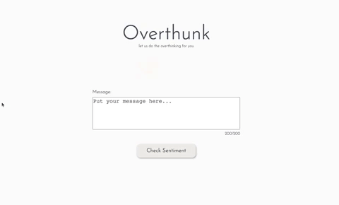

# Overthunk 🧐 

[View Deployment](https://handy-breath.surge.sh/)

### Overview

Overthunk is an app designed for users who spend way too much time thinking about the messages they send to other people online. By filtering messages through the [Sentim-API](https://sentim-api.herokuapp.com/), users can get a quick, unbiased look at the overall tone of potential comments/messages, without spending all day thinking about it!

### Using the App

- Enter a message into the text box on the homepage (messages are limited to 200 characters to prevent overthinking)
- Click the "Check Sentiment" button to view the overall tone of your message (positive, negative, or neutral)
- The "Save" button will save the message in your drafts, or you can go back to edit the message & check it again
- If there are saved drafts, these can be viewed & compared by clicking the draft buttons at the bottom of the page (in order to prevent overthinking, the draft limit is set to three)

### Technologies

[React](https://reactjs.org/), [Fetch API](https://developer.mozilla.org/en-US/docs/Web/API/Fetch_API), [Animate.css](https://animate.style/), [Cypress](https://docs.cypress.io/guides/overview/why-cypress)

### Installation

- Fork & `git clone` this repo
- `cd` into the project directory & run `npm i` to install dependencies
- Enter `npm start` to start the development server
- Enter `npm run cypress` to open cypress testing

### Demo

### Project Wins

The goal of this project was to create an app tailored to suit a niche audience in a short amount of time. After coming across the [Sentim-API](https://sentim-api.herokuapp.com/), I realized it could be useful for people that often have trouble sending messages online. Specifically, I wanted to help users easily test wether a message conveys its intended tone. The audience that could benefit from this includes overthinkers (like myself), users who are less familiar with nuances in online communication, or neuro-divergent users. I tried to keep the design of this app as simple as possible, to try & prevent users from interpreting anything other than the result of checking their messages (for example, using non-neutral colors could potentially send mixed signals; a negative result does not necessairly mean "bad"). My biggest win from this project was successfully creating a MVP that met these requirements, and has the potential to help a unique audience.

### What's Next?

- View a more detailed report (results broken down by sentence)
- Ability to send directly to messaging apps (integration with Instagram, SMS applications, etc.)

